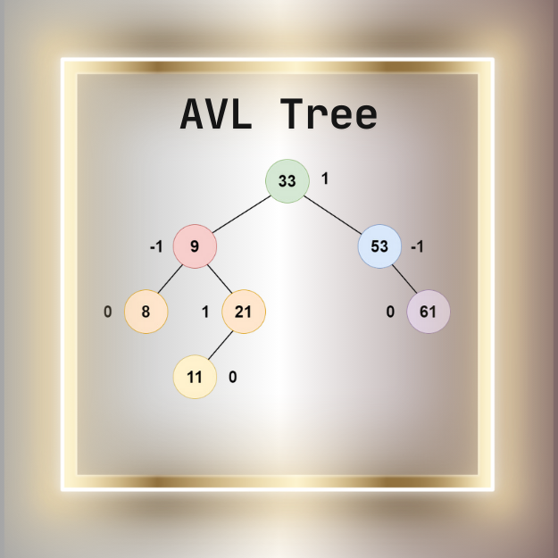

<div align="center">
<br>



</div>


<p align="center">


</p>


<h1 align="center"> AVL Trees </h1>


<h3 align="center">
<a href="https://github.com/RazikaBengana/holbertonschool-interview/tree/main/avl_trees#eye-about">About</a> •
<a href="https://github.com/RazikaBengana/holbertonschool-interview/tree/main/avl_trees#computer-requirements">Requirements</a> •
<a href="https://github.com/RazikaBengana/holbertonschool-interview/tree/main/avl_trees#keyboard-more-info">More Info</a> •
<a href="https://github.com/RazikaBengana/holbertonschool-interview/tree/main/avl_trees#hammer_and_wrench-task">Task</a>
</h3>

---

<!-- ------------------------------------------------------------------------------------------------- -->

<br>
<br>

## :eye: About

<br>

<div align="center">

**`AVL Trees`** project involves creating and manipulating AVL trees.
<br>
The project covers rotations and balancing of binary search trees.
<br>
<br>
This project has been created by **[Holberton School](https://www.holbertonschool.com/about-holberton)** to enable every student to understand how self-balancing trees in `C` work.

</div>

<br>
<br>

<!-- ------------------------------------------------------------------------------------------------- -->

## :computer: Requirements

<br>

```diff

General

+ Allowed editors: vi, vim, emacs

+ All your files will be compiled on Ubuntu 14.04 LTS

+ Your programs and functions will be compiled with gcc 4.8.4 using the flags -Wall -Werror -Wextra and -pedantic

+ All your files should end with a new line

+ A README.md file, at the root of the folder of the project, is mandatory

+ Your code should use the Betty style. It will be checked using betty-style.pl and betty-doc.pl

- You are not allowed to use global variables

+ No more than 5 functions per file

+ You are allowed to use the standard library

+ In the following examples, the main.c files are shown as examples. You can use them to test your functions, but you don’t have to push them to your repo (if you do we won’t take them into account). We will use our own main.c files at compilation. Our main.c files might be different from the one shown in the examples

+ The prototypes of all your functions should be included in your header file called binary_trees.h

+ Don’t forget to push your header file

+ All your header files should be include guarded

```

<br>

**_Why all your files should end with a new line? See [HERE](https://unix.stackexchange.com/questions/18743/whats-the-point-in-adding-a-new-line-to-the-end-of-a-file/18789)_**

<br>
<br>

<!-- ------------------------------------------------------------------------------------------------- -->

## :keyboard: More Info

<br>

### Data structures:

<br>

Please use the following data structures and types for `binary trees`. <br>
Don’t forget to include them in your header file:

<br>

#### Basic Binary Tree:

<br>

```c
/**
 * struct binary_tree_s - Binary tree node
 *
 * @n: Integer stored in the node
 * @parent: Pointer to the parent node
 * @left: Pointer to the left child node
 * @right: Pointer to the right child node
 */
struct binary_tree_s
{
    int n;
    struct binary_tree_s *parent;
    struct binary_tree_s *left;
    struct binary_tree_s *right;
};

typedef struct binary_tree_s binary_tree_t;
```

<br>
<br>

#### AVL Tree:

<br>

```c
typedef struct binary_tree_s avl_t;
```

<br>
<br>

#### Print function:

<br>

- To match the examples in the tasks, you are given [this function](https://github.com/hs-hq/0x1C.c).

    - This function is used only for visualisation purpose. <br>
      You don’t have to push it to your repo. <br>
      It may not be used during the correction.

<br>
<br>

<!-- ------------------------------------------------------------------------------------------------- -->

### :hammer_and_wrench: Task

<br>

<table align="center">
<tr>
<td>

### **`0. Is AVL`**

---

<br>

Write a function that checks if a binary tree is a valid [AVL Tree](https://en.wikipedia.org/wiki/AVL_tree)

- Prototype: `int binary_tree_is_avl(const binary_tree_t *tree);`

- Where `tree` is a pointer to the root node of the tree to check

- Your function must return `1` if `tree` is a valid AVL Tree, and `0` otherwise

- If `tree` is `NULL`, return `0`

<br>

Properties of an AVL Tree:

- An AVL Tree is a BST

- The difference between heights of left and right subtrees cannot be more than one

- The left and right subtree each must also be a binary search tree

<br>

:pushpin: **Note**:

In order for the main file to compile, you are provided with this [static library](https://drive.google.com/file/d/132seKEZk_yZn-BhLEwH8RH9KgePBNIzn/view?usp=drive_link). <br>
This library won’t be used during correction, its only purpose is for testing.

<br>
<br>

```c
alex@/tmp/binary_trees$ cat 0-main.c
#include <stdlib.h>
#include <stdio.h>
#include "binary_trees.h"

/**
 * basic_tree - Build a basic binary tree
 *
 * Return: A pointer to the created tree
 */
binary_tree_t *basic_tree(void)
{
    binary_tree_t *root;

    root = binary_tree_node(NULL, 98);
    root->left = binary_tree_node(root, 12);
    root->right = binary_tree_node(root, 128);
    root->left->right = binary_tree_node(root->left, 54);
    root->right->right = binary_tree_node(root, 402);
    root->left->left = binary_tree_node(root->left, 10);
    return (root);
}

/**
 * main - Entry point
 *
 * Return: Always 0 (Success)
 */
int main(void)
{
    binary_tree_t *root;
    int avl;

    root = basic_tree();

    binary_tree_print(root);
    avl = binary_tree_is_avl(root);
    printf("Is %d avl: %d\n", root->n, avl);
    avl = binary_tree_is_avl(root->left);
    printf("Is %d avl: %d\n", root->left->n, avl);

    root->right->left = binary_tree_node(root->right, 97);
    binary_tree_print(root);
    avl = binary_tree_is_avl(root);
    printf("Is %d avl: %d\n", root->n, avl);

    root = basic_tree();
    root->right->right->right = binary_tree_node(root->right->right, 430);
    binary_tree_print(root);
    avl = binary_tree_is_avl(root);
    printf("Is %d avl: %d\n", root->n, avl);

    root->right->right->right->left = binary_tree_node(root->right->right->right, 420);
    binary_tree_print(root);
    avl = binary_tree_is_avl(root);
    printf("Is %d avl: %d\n", root->n, avl);
    return (0);
}
```

<br>

```c
alex@/tmp/binary_trees$ gcc -Wall -Wextra -Werror -pedantic binary_tree_print.c 0-main.c 0-binary_tree_is_avl.c -L. -lavl -o 0-is_avl
alex@/tmp/binary_trees$ ./0-is_avl
       .-------(098)--.
  .--(012)--.       (128)--.
(010)     (054)          (402)
Is 98 avl: 1
Is 12 avl: 1
       .-------(098)-------.
  .--(012)--.         .--(128)--.
(010)     (054)     (097)     (402)
Is 98 avl: 0
       .-------(098)--.
  .--(012)--.       (128)--.
(010)     (054)          (402)--.
                              (430)
Is 98 avl: 0
       .-------(098)--.
  .--(012)--.       (128)--.
(010)     (054)          (402)-------.
                                .--(430)
                              (420)
Is 98 avl: 0
alex@/tmp/binary_trees$
```

<br>

</td>
</tr>
</table>