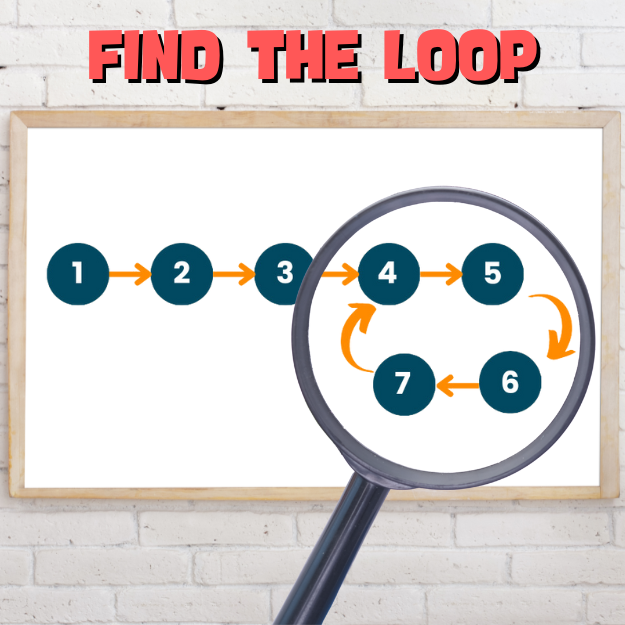

<div align="center">
<br>



</div>


<p align="center">


</p>


<h1 align="center"> Find the Loop </h1>


<h3 align="center">
<a href="https://github.com/RazikaBengana/holbertonschool-interview/tree/main/find_the_loop#eye-about">About</a> •
<a href="https://github.com/RazikaBengana/holbertonschool-interview/tree/main/find_the_loop#computer-requirements">Requirements</a> •
<a href="https://github.com/RazikaBengana/holbertonschool-interview/tree/main/find_the_loop#keyboard-more-info">More Info</a> •
<a href="https://github.com/RazikaBengana/holbertonschool-interview/tree/main/find_the_loop#hammer_and_wrench-task">Task</a>
</h3>

---

<!-- ------------------------------------------------------------------------------------------------- -->

<br>
<br>

## :eye: About

<br>

<div align="center">

**`Find the Loop`** project focuses on detecting loops within linked lists.
<br>
The project highlights techniques to identify cycles in data structures.
<br>
<br>
This project has been created by **[Holberton School](https://www.holbertonschool.com/about-holberton)** to enable every student to understand how cycle detection in `C` works.

</div>

<br>
<br>

<!-- ------------------------------------------------------------------------------------------------- -->

## :computer: Requirements

<br>

```diff

General

+ Allowed editors: vi, vim, emacs

+ All your files will be compiled on Ubuntu 14.04 LTS

+ Your programs and functions will be compiled with gcc 4.8.4 using the flags -Wall -Werror -Wextra and -pedantic

+ All your files should end with a new line

+ A README.md file, at the root of the folder of the project is mandatory

+ Your code should use the Betty style. It will be checked using betty-style.pl and betty-doc.pl

- You are not allowed to use global variables

+ No more than 5 functions per file

- No standard library functions allowed. Any use of functions like printf, puts, calloc, realloc etc… is forbidden

+ In the following examples, the main.c files are shown as examples. You can use them to test your functions, but you don’t have to push them to your repo (if you do we won’t take them into account). We will use our own main.c files at compilation. Our main.c files might be different from the one shown in the examples

+ The prototypes of all your functions should be included in your header file called lists.h

+ Don’t forget to push your header file

+ All your header files should be include guarded

```

<br>

**_Why all your files should end with a new line? See [HERE](https://unix.stackexchange.com/questions/18743/whats-the-point-in-adding-a-new-line-to-the-end-of-a-file/18789)_**

<br>
<br>

<!-- ------------------------------------------------------------------------------------------------- -->

## :keyboard: More Info

<br>

- Please use this `lists.h`:

<br>

```c
#ifndef _LISTS_H_
#define _LISTS_H_

#include <stddef.h>


/**
 * struct listint_s - singly linked list
 * @n: integer
 * @next: points to the next node
 *
 * Description: singly linked list node structure
 * for Holberton project
 */
typedef struct listint_s
{
    int n;
    struct listint_s *next;
} listint_t;

listint_t *add_nodeint(listint_t **head, const int n);
size_t print_listint_safe(const listint_t *head);
size_t free_listint_safe(listint_t **h);

listint_t *find_listint_loop(listint_t *head);

#endif
```

<br>
<br>

<!-- ------------------------------------------------------------------------------------------------- -->

## :hammer_and_wrench: Task

<br>

<table align="center">
<tr>
<td>

### **`0. Find the loop`**

---

<br>

- Write a function that finds the loop in a linked list.

    - Prototype: `listint_t *find_listint_loop(listint_t *head);`

    - Returns: The address of the node where the loop starts, or `NULL` if there is no loop

    - You are not allowed to use `malloc`, `free` or arrays

    - You can only declare a maximum of two variables in your function

<br>

:pushpin: **Note**:

In order to compile the main file, you are provided with [this static library](https://drive.google.com/file/d/12xh6v0N257IyXSEddsSLhfC-iOdLRDFA/view?usp=drive_link). <br>
This library won’t be used during the correction; <br>
Its only purpose is for testing.

<br>
<br>

```c
alexa@ubuntu:~/find_the_loop$ cat 0-main.c 
#include <stdlib.h>
#include <string.h>
#include <stdio.h>
#include "lists.h"

/**
 * main - check the code for Holberton School students.
 *
 * Return: Always 0.
 */
int main(void)
{
    listint_t *head;
    listint_t *head2;
    listint_t *node;

    head2 = NULL;
    add_nodeint(&head2, 0);
    add_nodeint(&head2, 1);
    add_nodeint(&head2, 2);
    add_nodeint(&head2, 3);
    add_nodeint(&head2, 4);
    add_nodeint(&head2, 98);
    add_nodeint(&head2, 402);
    add_nodeint(&head2, 1024);
    print_listint_safe(head2);
    node = find_listint_loop(head2);
    if (node != NULL)
    {
        printf("Loop starts at [%p] %d\n", (void *)node, node->n);
    }
    free_listint_safe(&head2);
    head = NULL;
    node = add_nodeint(&head, 0);
    add_nodeint(&head, 1);
    add_nodeint(&head, 2);
    add_nodeint(&head, 3);
    add_nodeint(&head, 4);
    add_nodeint(&head, 5);
    add_nodeint(&head, 6);
    node->next = add_nodeint(&head, 7);
    add_nodeint(&head, 98);
    add_nodeint(&head, 402);
    add_nodeint(&head, 1024);
    print_listint_safe(head);
    node = find_listint_loop(head);
    if (node != NULL)
    {
        printf("Loop starts at [%p] %d\n", (void *)node, node->n);
    }
    free_listint_safe(&head);
    return (0);
}
```

<br>

```c
alexa@ubuntu:~/find_the_loop$ gcc -Wall -pedantic -Werror -Wextra 0-main.c 0-find_loop.c -L. -lloop -o main
alexa@ubuntu:~/find_the_loop$ ./main
[0x13700f0] 1024
[0x13700d0] 402
[0x13700b0] 98
[0x1370090] 4
[0x1370070] 3
[0x1370050] 2
[0x1370030] 1
[0x1370010] 0
[0x1370560] 1024
[0x1370540] 402
[0x1370010] 98
[0x1370030] 7
[0x1370050] 6
[0x1370070] 5
[0x1370090] 4
[0x13700b0] 3
[0x13700d0] 2
[0x13700f0] 1
[0x1370110] 0
-> [0x1370030] 7
Loop starts at [0x1370030] 7
alexa@ubuntu:~/find_the_loop$ 
```

<br>

- If you want to use source file instead of the `libloop.a` library, please use this file [lib.c](https://drive.google.com/file/d/12yaWMxCz0pfcs91u48vh34oUNBHqEiXi/view?usp=drive_link)

    - compile it with this command: `$ gcc -Wall -pedantic -Werror -Wextra 0-main.c 0-find_loop.c lib.c -o main`

<br>

</td>
</tr>
</table>