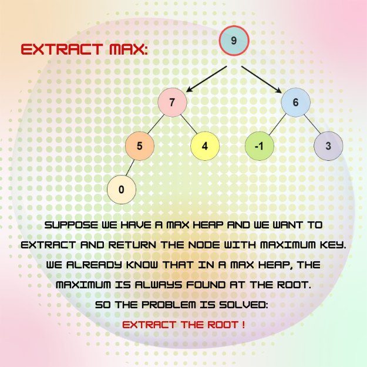

<div align="center">
<br>



</div>


<p align="center">


</p>


<h1 align="center"> Heap Extract </h1>


<h3 align="center">
<a href="https://github.com/RazikaBengana/holbertonschool-interview/tree/main/heap_extract#eye-about">About</a> •
<a href="https://github.com/RazikaBengana/holbertonschool-interview/tree/main/heap_extract#computer-requirements">Requirements</a> •
<a href="https://github.com/RazikaBengana/holbertonschool-interview/tree/main/heap_extract#keyboard-more-info">More Info</a> •
<a href="https://github.com/RazikaBengana/holbertonschool-interview/tree/main/heap_extract#hammer_and_wrench-task">Task</a>
</h3>

---

<!-- ------------------------------------------------------------------------------------------------- -->

<br>
<br>

## :eye: About

<br>

<div align="center">

**`Heap Extract`** project involves extracting elements from a heap data structure.
<br>
The project demonstrates heap operations and maintenance.
<br>
<br>
This project has been created by **[Holberton School](https://www.holbertonschool.com/about-holberton)** to enable every student to understand how heap operations in `C` work.

</div>

<br>
<br>

<!-- ------------------------------------------------------------------------------------------------- -->

## :computer: Requirements

<br>

```diff

General

+ Allowed editors: vi, vim, emacs

+ All your files will be compiled on Ubuntu 14.04 LTS

+ Your programs and functions will be compiled with gcc 4.8.4 using the flags -Wall -Werror -Wextra and -pedantic

+ All your files should end with a new line

+ A README.md file, at the root of the folder of the project, is mandatory

+ Your code should use the Betty style. It will be checked using betty-style.pl and betty-doc.pl

- You are not allowed to use global variables

+ No more than 5 functions per file

+ You are allowed to use the standard library

+ In the following examples, the main.c files are shown as examples. You can use them to test your functions, but you don’t have to push them to your repo (if you do we won’t take them into account). We will use our own main.c files at compilation. Our main.c files might be different from the one shown in the examples

+ The prototypes of all your functions should be included in your header file called binary_trees.h

+ Don’t forget to push your header file

+ All your header files should be include guarded

```

<br>

**_Why all your files should end with a new line? See [HERE](https://unix.stackexchange.com/questions/18743/whats-the-point-in-adding-a-new-line-to-the-end-of-a-file/18789)_**

<br>
<br>

<!-- ------------------------------------------------------------------------------------------------- -->

## :keyboard: More Info

<br>

### Data structures:

<br>

Please use the following data structures and types for `binary trees`. <br>
Don’t forget to include them in your header file:

<br>

#### Basic Binary Tree:

<br>

```c
/**
 * struct binary_tree_s - Binary tree node
 *
 * @n: Integer stored in the node
 * @parent: Pointer to the parent node
 * @left: Pointer to the left child node
 * @right: Pointer to the right child node
 */
struct binary_tree_s
{
    int n;
    struct binary_tree_s *parent;
    struct binary_tree_s *left;
    struct binary_tree_s *right;
};

typedef struct binary_tree_s binary_tree_t;
```

<br>
<br>

#### Max Binary Heap:

<br>

```c
typedef struct binary_tree_s heap_t;
```

<br>
<br>

#### Print function:

<br>

- To match the examples in the tasks, you are given [this function](https://github.com/hs-hq/0x1C.c).

    - This function is used only for visualisation purpose. <br>
      You don’t have to push it to your repo. <br>
      It may not be used during the correction.

<br>
<br>

<!-- ------------------------------------------------------------------------------------------------- -->

## :hammer_and_wrench: Task

<br>

<table align="center">
<tr>
<td>

### **`0. Heap - Extract`**

---

<br>

- Write a function that extracts the root node of a Max Binary Heap:

    - Prototype: `int heap_extract(heap_t **root);`

    - `root` is a double pointer to the root node of the heap

    - Your function must return the value stored in the root node

    - The root node must be freed and replace with the last `level-order` node of the heap

    - Once replaced, the heap must be rebuilt if necessary

    - If your function fails, return `0`

<br>

:pushpin: **Note**:

In order for the main file to compile, you are provided with [this static library](https://drive.google.com/file/d/12xPaV4mc3ib2jlcCUch9rybx-sjSCJHR/view?usp=drive_link). <br>
This library won’t be used during correction, its only purpose is for testing.

<br>
<br>

```c
alex@/tmp/binary_trees$ cat 0-main.c
#include <stdlib.h>
#include <stdio.h>

#include "binary_trees.h"

/*
 * The following are helpers functions needed in this main file
 * You don't need them in your `heap_extract function`.
 */
heap_t *_array_to_heap(int *array, size_t size);
void binary_tree_print(const binary_tree_t *tree);
void _binary_tree_delete(binary_tree_t *tree);

/**
 * main - Entry point
 *
 * Return: 0 on success, error code on failure
 */
int main(void)
{
    heap_t *tree;
    int array[] = {
        79, 47, 68, 87, 84, 91, 21, 32, 34, 2,
        20, 22, 98, 1, 62, 95
    };
    size_t n = sizeof(array) / sizeof(array[0]);
    int extract;

    tree = _array_to_heap(array, n);
    if (!tree)
        return (1);
    binary_tree_print(tree);

    extract = heap_extract(&tree);
    printf("Extracted: %d\n", extract);
    binary_tree_print(tree);

    extract = heap_extract(&tree);
    printf("Extracted: %d\n", extract);
    binary_tree_print(tree);

    extract = heap_extract(&tree);
    printf("Extracted: %d\n", extract);
    binary_tree_print(tree);
    _binary_tree_delete(tree);
    return (0);
}
```

<br>

```c
alex@/tmp/binary_trees$ gcc -Wall -Wextra -Werror -pedantic -o 0-heap_extract 0-main.c 0-heap_extract.c binary_tree_print.c -L. -lheap
alex@/tmp/binary_trees$ valgrind ./0-heap_extract
==29133== Memcheck, a memory error detector
==29133== Copyright (C) 2002-2013, and GNU GPL'd, by Julian Seward et al.
==29133== Using Valgrind-3.10.1 and LibVEX; rerun with -h for copyright info
==29133== Command: ./0-heap_extract
==29133== 
                      .-----------------(098)-----------------.
            .-------(095)-------.                   .-------(091)-------.
       .--(084)--.         .--(079)--.         .--(087)--.         .--(062)--.
  .--(047)     (034)     (002)     (020)     (022)     (068)     (001)     (021)
(032)
Extracted: 98
                 .-----------------(095)-----------------.
       .-------(084)-------.                   .-------(091)-------.
  .--(047)--.         .--(079)--.         .--(087)--.         .--(062)--.
(032)     (034)     (002)     (020)     (022)     (068)     (001)     (021)
Extracted: 95
                 .-----------------(091)-----------------.
       .-------(084)-------.                   .-------(087)-------.
  .--(047)--.         .--(079)--.         .--(068)--.         .--(062)
(032)     (034)     (002)     (020)     (022)     (021)     (001)
Extracted: 91
                 .-----------------(087)-----------------.
       .-------(084)-------.                   .-------(068)--.
  .--(047)--.         .--(079)--.         .--(022)--.       (062)
(032)     (034)     (002)     (020)     (001)     (021)
==29133== 
==29133== HEAP SUMMARY:
==29133==     in use at exit: 0 bytes in 0 blocks
==29133==   total heap usage: 213 allocs, 213 frees, 9,063 bytes allocated
==29133== 
==29133== All heap blocks were freed -- no leaks are possible
==29133== 
==29133== For counts of detected and suppressed errors, rerun with: -v
==29133== ERROR SUMMARY: 0 errors from 0 contexts (suppressed: 0 from 0)
alex@/tmp/binary_trees$
```

<br>

</td>
</tr>
</table>