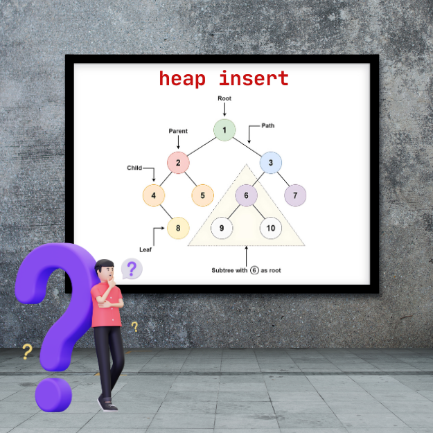

<div align="center">
<br>



</div>


<p align="center">


</p>


<h1 align="center"> Heap Insert </h1>


<h3 align="center">
<a href="https://github.com/RazikaBengana/holbertonschool-interview/tree/main/heap_insert#eye-about">About</a> •
<a href="https://github.com/RazikaBengana/holbertonschool-interview/tree/main/heap_insert#computer-requirements">Requirements</a> •
<a href="https://github.com/RazikaBengana/holbertonschool-interview/tree/main/heap_insert#keyboard-more-info">More Info</a> •
<a href="https://github.com/RazikaBengana/holbertonschool-interview/tree/main/heap_insert#hammer_and_wrench-tasks">Tasks</a>
</h3>

---

<!-- ------------------------------------------------------------------------------------------------- -->

<br>
<br>

## :eye: About

<br>

<div align="center">

**`Heap Insert`** project is about inserting elements into a heap.
<br>
The project covers maintaining heap properties during insertion.
<br>
<br>
This project has been created by **[Holberton School](https://www.holbertonschool.com/about-holberton)** to enable every student to understand how heap insertion in `C` works.

</div>

<br>
<br>

<!-- ------------------------------------------------------------------------------------------------- -->

## :computer: Requirements

<br>

```diff

General

+ Allowed editors: vi, vim, emacs

+ All your files will be compiled on Ubuntu 14.04 LTS

+ Your programs and functions will be compiled with gcc 4.8.4 using the flags -Wall -Werror -Wextra and -pedantic

+ All your files should end with a new line

+ A README.md file, at the root of the folder of the project, is mandatory

+ Your code should use the Betty style. It will be checked using betty-style.pl and betty-doc.pl

- You are not allowed to use global variables

+ No more than 5 functions per file

+ You are allowed to use the standard library

+ In the following examples, the main.c files are shown as examples. You can use them to test your functions, but you don’t have to push them to your repo (if you do we won’t take them into account). We will use our own main.c files at compilation. Our main.c files might be different from the one shown in the examples

+ The prototypes of all your functions should be included in your header file called binary_trees.h

+ Don’t forget to push your header file

+ All your header files should be include guarded

```

<br>

**_Why all your files should end with a new line? See [HERE](https://unix.stackexchange.com/questions/18743/whats-the-point-in-adding-a-new-line-to-the-end-of-a-file/18789)_**

<br>
<br>

<!-- ------------------------------------------------------------------------------------------------- -->

## :keyboard: More Info

<br>

### Data structures:

<br>

Please use the following data structures and types for `binary trees`. <br>
Don’t forget to include them in your header file:

<br>

#### Basic Binary Tree:

<br>

```c
/**
 * struct binary_tree_s - Binary tree node
 *
 * @n: Integer stored in the node
 * @parent: Pointer to the parent node
 * @left: Pointer to the left child node
 * @right: Pointer to the right child node
 */
struct binary_tree_s
{
    int n;
    struct binary_tree_s *parent;
    struct binary_tree_s *left;
    struct binary_tree_s *right;
};
```

<br>
<br>

#### Max Binary Heap:

<br>

```c
typedef struct binary_tree_s heap_t;
```

<br>
<br>

#### Print function:

<br>

- To match the examples in the tasks, you are given [this function](https://github.com/hs-hq/0x1C.c).

    - This function is used only for visualisation purpose. <br>
      You don’t have to push it to your repo. <br>
      It may not be used during the correction.

<br>
<br>

<!-- ------------------------------------------------------------------------------------------------- -->

## :hammer_and_wrench: Tasks

<br>

<table align="center">
<tr>
<td>

### **`0. New node`**

---

<br>

- Write a function that creates a binary tree node:

    - Prototype: `binary_tree_t *binary_tree_node(binary_tree_t *parent, int value);`

    - `parent` is a pointer to the parent node of the node to create

    - `value` is the value to put in the new node

    - When created, a node does not have any children

    - Your function must return a pointer to the new node, or `NULL` on failure

<br>
<br>

```c
alex@/tmp/binary_trees$ cat 0-main.c 
#include <stdlib.h>
#include "binary_trees.h"

/**
 * _binary_tree_delete - Deallocate a binary tree
 *
 * @tree: Pointer to the root of the tree to delete
 */
static void _binary_tree_delete(binary_tree_t *tree)
{
    if (tree)
    {
        _binary_tree_delete(tree->left);
        _binary_tree_delete(tree->right);
        free(tree);
    }
}

/**
 * main - Entry point
 *
 * Return: Always 0 (Success)
 */
int main(void)
{
    binary_tree_t *root;

    root = binary_tree_node(NULL, 98);

    root->left = binary_tree_node(root, 12);
    root->left->left = binary_tree_node(root->left, 6);
    root->left->right = binary_tree_node(root->left, 16);

    root->right = binary_tree_node(root, 402);
    root->right->left = binary_tree_node(root->right, 256);
    root->right->right = binary_tree_node(root->right, 512);

    binary_tree_print(root);
    _binary_tree_delete(root);
    return (0);
}
```

<br>

```c
alex@/tmp/binary_trees$ gcc -Wall -Wextra -Werror -pedantic binary_tree_print.c 0-main.c 0-binary_tree_node.c -o 0-node
alex@/tmp/binary_trees$ ./0-node
       .-------(098)-------.
  .--(012)--.         .--(402)--.
(006)     (016)     (256)     (512)
alex@/tmp/binary_trees$
```

<br>

</td>
</tr>
</table>

<br>
<br>

<table align="center">
<tr>
<td>

### **`1. Heap - Insert`**

---

<br>

- Write a function that inserts a value into a Max Binary Heap:

    - Prototype: `heap_t *heap_insert(heap_t **root, int value);`

    - `root` is a double pointer to the root node of the Heap

    - `value` is the value to store in the node to be inserted

    - Your function must return a pointer to the inserted node, or `NULL` on failure

    - If the address stored in `root` is `NULL`, the created node must become the root node

    - You have to respect a `Max Heap` ordering

    - You are allowed to have up to **6 functions** in your file

<br>

- Your file `0-binary_tree_node.c` will be compiled during the correction

<br>
<br>

```c
alex@/tmp/binary_trees$ cat 1-main.c
#include <stdlib.h>
#include <stdio.h>
#include "binary_trees.h"

/**
 * _binary_tree_delete - Deallocate a binary tree
 *
 * @tree: Pointer to the root of the tree to delete
 */
static void _binary_tree_delete(binary_tree_t *tree)
{
    if (tree)
    {
        _binary_tree_delete(tree->left);
        _binary_tree_delete(tree->right);
        free(tree);
    }
}

/**
 * main - Entry point
 *
 * Return: 0 on success, error code on failure
 */
int main(void)
{
    heap_t *root;
    heap_t *node;

    root = NULL;
    node = heap_insert(&root, 98);
    printf("Inserted: %d\n", node->n);
    binary_tree_print(root);
    node = heap_insert(&root, 402);
    printf("\nInserted: %d\n", node->n);
    binary_tree_print(root);
    node = heap_insert(&root, 12);
    printf("\nInserted: %d\n", node->n);
    binary_tree_print(root);
    node = heap_insert(&root, 46);
    printf("\nInserted: %d\n", node->n);
    binary_tree_print(root);
    node = heap_insert(&root, 128);
    printf("\nInserted: %d\n", node->n);
    binary_tree_print(root);
    node = heap_insert(&root, 256);
    printf("\nInserted: %d\n", node->n);
    binary_tree_print(root);
    node = heap_insert(&root, 512);
    printf("\nInserted: %d\n", node->n);
    binary_tree_print(root);
    node = heap_insert(&root, 50);
    printf("\nInserted: %d\n", node->n);
    binary_tree_print(root);
    _binary_tree_delete(root);
    return (0);
}
```

<br>

```c
alex@/tmp/binary_trees$ gcc -Wall -Wextra -Werror -pedantic binary_tree_print.c 1-main.c 1-heap_insert.c 0-binary_tree_node.c -o 1-heap_insert
alex@/tmp/binary_trees$ ./1-heap_insert
Inserted: 98
(098)

Inserted: 402
  .--(402)
(098)

Inserted: 12
  .--(402)--.
(098)     (012)

Inserted: 46
       .--(402)--.
  .--(098)     (012)
(046)

Inserted: 128
       .-------(402)--.
  .--(128)--.       (012)
(046)     (098)

Inserted: 256
       .-------(402)-------.
  .--(128)--.         .--(256)
(046)     (098)     (012)

Inserted: 512
       .-------(512)-------.
  .--(128)--.         .--(402)--.
(046)     (098)     (012)     (256)

Inserted: 50
            .-------(512)-------.
       .--(128)--.         .--(402)--.
  .--(050)     (098)     (012)     (256)
(046)
alex@/tmp/binary_trees$
```

<br>

</td>
</tr>
</table>