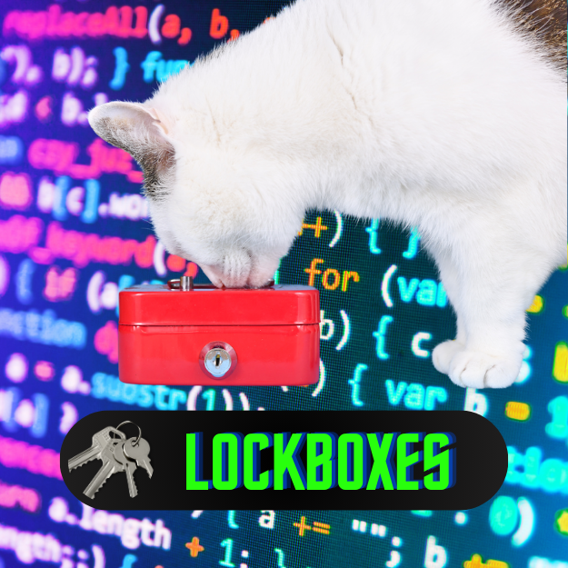

<div align="center">
<br>



</div>


<p align="center">


</p>


<h1 align="center"> Lockboxes </h1>


<h3 align="center">
<a href="https://github.com/RazikaBengana/holbertonschool-interview/tree/main/lockboxes#eye-about">About</a> •
<a href="https://github.com/RazikaBengana/holbertonschool-interview/tree/main/lockboxes#computer-requirements">Requirements</a> •
<a href="https://github.com/RazikaBengana/holbertonschool-interview/tree/main/lockboxes#hammer_and_wrench-task">Task</a>
</h3>

---

<!-- ------------------------------------------------------------------------------------------------- -->

<br>
<br>

## :eye: About

<br>

<div align="center">

**`Lockboxes`** project deals with unlocking a series of lockboxes using keys.
<br>
The project demonstrates problem-solving with key-value relationships.
<br>
<br>
This project has been created by **[Holberton School](https://www.holbertonschool.com/about-holberton)** to enable every student to understand how graph traversal concepts and data structures in `Python` work.

</div>

<br>
<br>

<!-- ------------------------------------------------------------------------------------------------- -->

## :computer: Requirements

<br>

```diff

General

+ Allowed editors: vi, vim, emacs

+ All your files will be interpreted/compiled on Ubuntu 14.04 LTS using python3 (version 3.4.3)

+ All your files should end with a new line

+ The first line of all your files should be exactly #!/usr/bin/python3

+ A README.md file, at the root of the folder of the project, is mandatory

+ Your code should be documented

+ Your code should use the PEP 8 style (version 1.7.x)

+ All your files must be executable

```

<br>

**_Why all your files should end with a new line? See [HERE](https://unix.stackexchange.com/questions/18743/whats-the-point-in-adding-a-new-line-to-the-end-of-a-file/18789)_**

<br>
<br>

<!-- ------------------------------------------------------------------------------------------------- -->

## :hammer_and_wrench: Task

<br>

<table align="center">
<tr>
<td>

### **`0. Lockboxes`**

---

<br>

You have `n` number of locked boxes in front of you.

Each box is numbered sequentially from `0` to `n - 1` and each box may contain keys to the other boxes.

<br>

- Write a method that determines if all the boxes can be opened.

    - Prototype: `def canUnlockAll(boxes)`

    - `boxes` is a list of lists

    - A key with the same number as a box opens that box

    - You can assume all keys will be positive integers

        - There can be keys that do not have boxes

    - The first box `boxes[0]` is unlocked

    - Return `True` if all boxes can be opened, else return `False`

<br>
<br>

```python
carrie@ubuntu:~/lockboxes$ cat main_0.py
#!/usr/bin/python3

canUnlockAll = __import__('0-lockboxes').canUnlockAll

boxes = [[1], [2], [3], [4], []]
print(canUnlockAll(boxes))

boxes = [[1, 4, 6], [2], [0, 4, 1], [5, 6, 2], [3], [4, 1], [6]]
print(canUnlockAll(boxes))

boxes = [[1, 4], [2], [0, 4, 1], [3], [], [4, 1], [5, 6]]
print(canUnlockAll(boxes))

carrie@ubuntu:~/lockboxes$
```

<br>

```python
carrie@ubuntu:~/lockboxes$ ./main_0.py
True
True
False
carrie@ubuntu:~/lockboxes$
```

<br>

</td>
</tr>
</table>