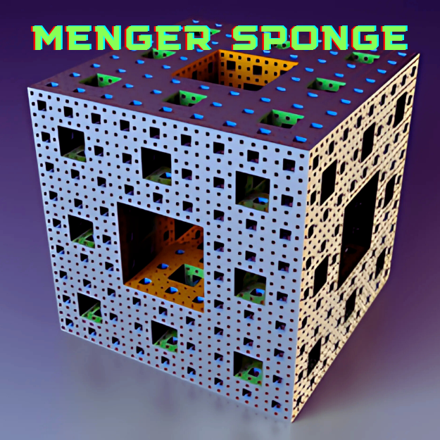

<div align="center">
<br>



</div>


<p align="center">


</p>


<h1 align="center"> Menger sponge </h1>


<h3 align="center">
<a href="https://github.com/RazikaBengana/holbertonschool-interview/tree/main/menger#eye-about">About</a> •
<a href="https://github.com/RazikaBengana/holbertonschool-interview/tree/main/menger#computer-requirements">Requirements</a> •
<a href="https://github.com/RazikaBengana/holbertonschool-interview/tree/main/menger#hammer_and_wrench-task">Task</a>
</h3>

---

<!-- ------------------------------------------------------------------------------------------------- -->

<br>
<br>

## :eye: About

<br>

<div align="center">

**`Menger sponge`** project is about generating Menger sponge fractals.
<br>
The project explores recursive patterns and fractal geometry.
<br>
<br>
This project has been created by **[Holberton School](https://www.holbertonschool.com/about-holberton)** to enable every student to understand how fractals in `C` work.

</div>

<br>
<br>

### Trip inside a `Menger Sponge` level 14 (3D fractal):

<br>

[](https://youtu.be/d-dI_pu_Z0g)

<br>
<br>

<!-- ------------------------------------------------------------------------------------------------- -->

## :computer: Requirements

<br>

```diff

General

+ Allowed editors: vi, vim, emacs

+ All your files will be compiled on Ubuntu 14.04 LTS

+ Your programs and functions will be compiled with gcc 4.8.4 using the flags -Wall -Werror -Wextra and -pedantic

+ All your files should end with a new line

+ Your code should use the Betty style. It will be checked using betty-style.pl and betty-doc.pl

- You are not allowed to use global variables

+ No more than 5 functions per file

+ In the following examples, the main.c files are shown as examples. You can use them to test your functions, but you don’t have to push them to your repo (if you do we won’t take them into account). We will use our own main.c files at compilation. Our main.c files might be different from the one shown in the examples

+ The prototypes of all your functions should be included in your header file called menger.h

+ Don’t forget to push your header file

+ All your header files should be include guarded

```

<br>

**_Why all your files should end with a new line? See [HERE](https://unix.stackexchange.com/questions/18743/whats-the-point-in-adding-a-new-line-to-the-end-of-a-file/18789)_**

<br>
<br>

<!-- ------------------------------------------------------------------------------------------------- -->

## :hammer_and_wrench: Task

<br>

<table align="center">
<tr>
<td>

### **`0. 2D Menger sponge`**

---

<br>

Write a function that draws a `2D Menger Sponge`

- Prototype: `void menger(int level);`
- Where `level` is the level of the Menger Sponge to draw
- If `level` is lower than 0, your function must do nothing
- You’re allowed to use the `math` library
    - Your program will be compiled using the `ld` flag -`lm`

<br>

Format:

- First, read [Menger sponge](https://en.wikipedia.org/wiki/Menger_sponge)
- Here, we will only draw a 2D version of the Menger sponge, but the principle is the same
- A level `N` sponge is a 3x3 square of level `N-1` sponges, except for the center one, which is left empty
- A level 0 sponge is represented by the `#` character

<br>

Examples:

- A level 0 sponge is a simple 1x1 square
- A level 1 sponge is a 3x3 square of level 0 sponges, except for the center one, which is left empty
- A level 2 sponge is a 3x3 square of level 1 sponges, except for the center one, which is left empty
- …

<br>

:bulb: **TIP**: The size of a level `N` Menger sponge is calculated as follows: `3^N`

<br>
<br>

```c
alex@~/menger$ cat 0-main.c 
#include <stdio.h>
#include <stdlib.h>

#include "menger.h"

/**
 * main - Entry point
 *
 * @ac: Arguments counter
 * @av: Arguments vector
 *
 * Return: EXIT_SUCCESS or EXIT_FAILURE
 */
int main(int ac, char **av)
{
    int level;

    if (ac < 2)
    {
        fprintf(stderr, "Usage: %s level\n", av[0]);
        return (EXIT_FAILURE);
    }

    level = atoi(av[1]);
    menger(level);

    return (EXIT_SUCCESS);
}
```

<br>

```c
alex@~/menger$ gcc -Wall -Wextra -Werror -pedantic -o 0-menger 0-menger.c 0-main.c -lm
alex@~/menger$ ./0-menger 0
#
alex@~/menger$ ./0-menger 1
###
# #
###
alex@~/menger$ ./0-menger 2
#########
# ## ## #
#########
###   ###
# #   # #
###   ###
#########
# ## ## #
#########
alex@~/menger$ ./0-menger 3
###########################
# ## ## ## ## ## ## ## ## #
###########################
###   ######   ######   ###
# #   # ## #   # ## #   # #
###   ######   ######   ###
###########################
# ## ## ## ## ## ## ## ## #
###########################
#########         #########
# ## ## #         # ## ## #
#########         #########
###   ###         ###   ###
# #   # #         # #   # #
###   ###         ###   ###
#########         #########
# ## ## #         # ## ## #
#########         #########
###########################
# ## ## ## ## ## ## ## ## #
###########################
###   ######   ######   ###
# #   # ## #   # ## #   # #
###   ######   ######   ###
###########################
# ## ## ## ## ## ## ## ## #
###########################
alex@~/menger$ ./0-menger 4
#################################################################################
# ## ## ## ## ## ## ## ## ## ## ## ## ## ## ## ## ## ## ## ## ## ## ## ## ## ## #
#################################################################################
###   ######   ######   ######   ######   ######   ######   ######   ######   ###
# #   # ## #   # ## #   # ## #   # ## #   # ## #   # ## #   # ## #   # ## #   # #
###   ######   ######   ######   ######   ######   ######   ######   ######   ###
#################################################################################
# ## ## ## ## ## ## ## ## ## ## ## ## ## ## ## ## ## ## ## ## ## ## ## ## ## ## #
#################################################################################
#########         ##################         ##################         #########
# ## ## #         # ## ## ## ## ## #         # ## ## ## ## ## #         # ## ## #
#########         ##################         ##################         #########
###   ###         ###   ######   ###         ###   ######   ###         ###   ###
# #   # #         # #   # ## #   # #         # #   # ## #   # #         # #   # #
###   ###         ###   ######   ###         ###   ######   ###         ###   ###
#########         ##################         ##################         #########
# ## ## #         # ## ## ## ## ## #         # ## ## ## ## ## #         # ## ## #
#########         ##################         ##################         #########
#################################################################################
# ## ## ## ## ## ## ## ## ## ## ## ## ## ## ## ## ## ## ## ## ## ## ## ## ## ## #
#################################################################################
###   ######   ######   ######   ######   ######   ######   ######   ######   ###
# #   # ## #   # ## #   # ## #   # ## #   # ## #   # ## #   # ## #   # ## #   # #
###   ######   ######   ######   ######   ######   ######   ######   ######   ###
#################################################################################
# ## ## ## ## ## ## ## ## ## ## ## ## ## ## ## ## ## ## ## ## ## ## ## ## ## ## #
#################################################################################
###########################                           ###########################
# ## ## ## ## ## ## ## ## #                           # ## ## ## ## ## ## ## ## #
###########################                           ###########################
###   ######   ######   ###                           ###   ######   ######   ###
# #   # ## #   # ## #   # #                           # #   # ## #   # ## #   # #
###   ######   ######   ###                           ###   ######   ######   ###
###########################                           ###########################
# ## ## ## ## ## ## ## ## #                           # ## ## ## ## ## ## ## ## #
###########################                           ###########################
#########         #########                           #########         #########
# ## ## #         # ## ## #                           # ## ## #         # ## ## #
#########         #########                           #########         #########
###   ###         ###   ###                           ###   ###         ###   ###
# #   # #         # #   # #                           # #   # #         # #   # #
###   ###         ###   ###                           ###   ###         ###   ###
#########         #########                           #########         #########
# ## ## #         # ## ## #                           # ## ## #         # ## ## #
#########         #########                           #########         #########
###########################                           ###########################
# ## ## ## ## ## ## ## ## #                           # ## ## ## ## ## ## ## ## #
###########################                           ###########################
###   ######   ######   ###                           ###   ######   ######   ###
# #   # ## #   # ## #   # #                           # #   # ## #   # ## #   # #
###   ######   ######   ###                           ###   ######   ######   ###
###########################                           ###########################
# ## ## ## ## ## ## ## ## #                           # ## ## ## ## ## ## ## ## #
###########################                           ###########################
#################################################################################
# ## ## ## ## ## ## ## ## ## ## ## ## ## ## ## ## ## ## ## ## ## ## ## ## ## ## #
#################################################################################
###   ######   ######   ######   ######   ######   ######   ######   ######   ###
# #   # ## #   # ## #   # ## #   # ## #   # ## #   # ## #   # ## #   # ## #   # #
###   ######   ######   ######   ######   ######   ######   ######   ######   ###
#################################################################################
# ## ## ## ## ## ## ## ## ## ## ## ## ## ## ## ## ## ## ## ## ## ## ## ## ## ## #
#################################################################################
#########         ##################         ##################         #########
# ## ## #         # ## ## ## ## ## #         # ## ## ## ## ## #         # ## ## #
#########         ##################         ##################         #########
###   ###         ###   ######   ###         ###   ######   ###         ###   ###
# #   # #         # #   # ## #   # #         # #   # ## #   # #         # #   # #
###   ###         ###   ######   ###         ###   ######   ###         ###   ###
#########         ##################         ##################         #########
# ## ## #         # ## ## ## ## ## #         # ## ## ## ## ## #         # ## ## #
#########         ##################         ##################         #########
#################################################################################
# ## ## ## ## ## ## ## ## ## ## ## ## ## ## ## ## ## ## ## ## ## ## ## ## ## ## #
#################################################################################
###   ######   ######   ######   ######   ######   ######   ######   ######   ###
# #   # ## #   # ## #   # ## #   # ## #   # ## #   # ## #   # ## #   # ## #   # #
###   ######   ######   ######   ######   ######   ######   ######   ######   ###
#################################################################################
# ## ## ## ## ## ## ## ## ## ## ## ## ## ## ## ## ## ## ## ## ## ## ## ## ## ## #
#################################################################################
alex@~/menger$ ./0-menger -1
alex@~/menger$
```

<br>

</td>
</tr>
</table>