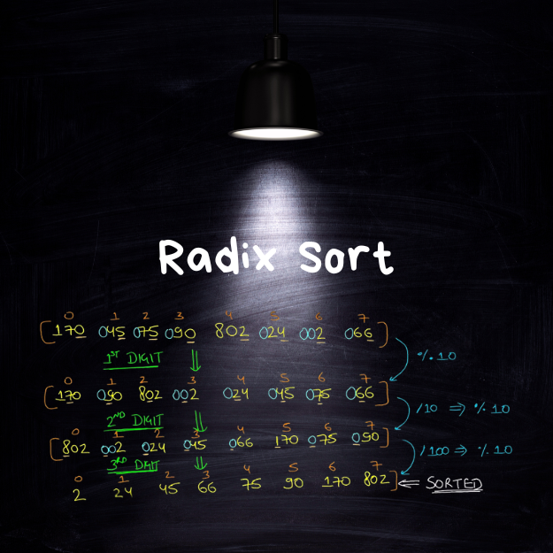

<div align="center">
<br>



</div>


<p align="center">


</p>


<h1 align="center"> Radix Sort </h1>


<h3 align="center">
<a href="https://github.com/RazikaBengana/holbertonschool-interview/tree/main/radix_sort#eye-about">About</a> •
<a href="https://github.com/RazikaBengana/holbertonschool-interview/tree/main/radix_sort#computer-requirements">Requirements</a> •
<a href="https://github.com/RazikaBengana/holbertonschool-interview/tree/main/radix_sort#keyboard-more-info">More Info</a> •
<a href="https://github.com/RazikaBengana/holbertonschool-interview/tree/main/radix_sort#hammer_and_wrench-task">Task</a>
</h3>

---

<!-- ------------------------------------------------------------------------------------------------- -->

<br>
<br>

## :eye: About

<br>

<div align="center">

**`Radix Sort`** project is about implementing the radix sort algorithm.
<br>
The project illustrates sorting using non-comparative techniques.
<br>
<br>
This project has been created by **[Holberton School](https://www.holbertonschool.com/about-holberton)** to enable every student to understand how sorting algorithms in `C` work.

</div>

<br>
<br>

<!-- ------------------------------------------------------------------------------------------------- -->

## :computer: Requirements

<br>

```diff

General

+ Allowed editors: vi, vim, emacs

+ All your files will be compiled on Ubuntu 14.04 LTS

+ Your programs and functions will be compiled with gcc 4.8.4 using the flags -Wall -Werror -Wextra and -pedantic

+ All your files should end with a new line

+ A README.md file, at the root of the folder of the project, is mandatory

+ Your code should use the Betty style. It will be checked using betty-style.pl and betty-doc.pl

- You are not allowed to use global variables

+ No more than 5 functions per file

- Unless specified otherwise, you are not allowed to use the standard library. Any use of functions like printf, puts, … is totally forbidden.

+ In the following examples, the main.c files are shown as examples. You can use them to test your functions, but you don’t have to push them to your repo (if you do we won’t take them into account). We will use our own main.c files at compilation. Our main.c files might be different from the one shown in the examples

+ The prototypes of all your functions should be included in your header file called sort.h

+ Don’t forget to push your header file

+ All your header files should be include guarded

- A list/array does not need to be sorted if its size is less than 2.

```

<br>

**_Why all your files should end with a new line? See [HERE](https://unix.stackexchange.com/questions/18743/whats-the-point-in-adding-a-new-line-to-the-end-of-a-file/18789)_**

<br>
<br>

<!-- ------------------------------------------------------------------------------------------------- -->

## :keyboard: More Info

<br>

- For this project you are given the following `print_array` function:

<br>

```c
alexa@ubuntu-xenial:radix_sort$ cat `print_array.c`
#include <stdlib.h>
#include <stdio.h>

/**
 * print_array - Prints an array of integers
 *
 * @array: The array to be printed
 * @size: Number of elements in @array
 */
void print_array(const int *array, size_t size)
{
    size_t i;

    i = 0;
    while (array && i < size)
    {
        if (i > 0)
            printf(", ");
        printf("%d", array[i]);
        ++i;
    }
    printf("\n");
}
alexa@ubuntu-xenial:radix_sort$
```

<br>

- Our file `print_array.c` will be compiled with your function during the correction.

- Please declare the prototype of the function `print_array` in your `sort.h` header file

<br>
<br>

<!-- ------------------------------------------------------------------------------------------------- -->

## :hammer_and_wrench: Task

<br>

<table align="center">
<tr>
<td>

### **`0. Radix sort`**

---

<br>

- Write a function that sorts an array of integers in ascending order using the [Radix sort](https://en.wikipedia.org/wiki/Radix_sort) algorithm

    - Prototype: `void radix_sort(int *array, size_t size);`

    - You must implement the `LSD` radix sort algorithm

    - You can assume that `array` will contain only numbers `>= 0`

    - You are allowed to use `malloc` and `free` for this task

    - You’re expected to print the `array` each time you increase your `significant digit` (See example below)

<br>
<br>

```c
alexa@ubuntu-xenial:radix_sort$ cat 0-main.c
#include <stdio.h>
#include <stdlib.h>
#include "sort.h"

/**
 * main - Entry point
 *
 * Return: Always 0
 */
int main(void)
{
    int array[] = {19, 48, 99, 71, 13, 52, 96, 73, 86, 7};
    size_t n = sizeof(array) / sizeof(array[0]);

    print_array(array, n);
    printf("\n");
    radix_sort(array, n);
    printf("\n");
    print_array(array, n);
    return (0);
}
```

<br>

```c
alexa@ubuntu-xenial:radix_sort$ gcc -Wall -Wextra -Werror -pedantic 0-main.c 0-radix_sort.c print_array.c -o radix
alexa@ubuntu-xenial:radix_sort$ ./radix
19, 48, 99, 71, 13, 52, 96, 73, 86, 7

71, 52, 13, 73, 96, 86, 7, 48, 19, 99
7, 13, 19, 48, 52, 71, 73, 86, 96, 99

7, 13, 19, 48, 52, 71, 73, 86, 96, 99
alexa@ubuntu-xenial:radix_sort$
```

<br>

</td>
</tr>
</table>