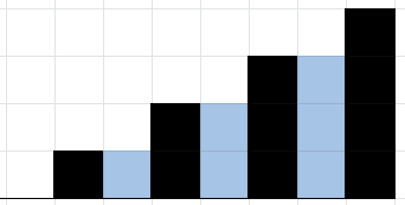
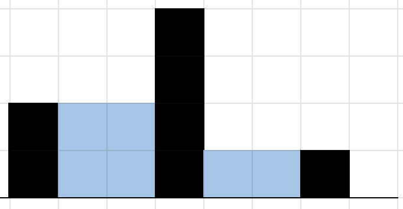

<div align="center">
<br>


</div>


<p align="center">


</p>


<h1 align="center"> Rain </h1>


<h3 align="center">
<a href="https://github.com/RazikaBengana/holbertonschool-interview/tree/main/rain#eye-about">About</a> •
<a href="https://github.com/RazikaBengana/holbertonschool-interview/tree/main/rain#computer-requirements">Requirements</a> •
<a href="https://github.com/RazikaBengana/holbertonschool-interview/tree/main/rain#hammer_and_wrench-task">Task</a>
</h3>

---

<!-- ------------------------------------------------------------------------------------------------- -->

<br>
<br>

## :eye: About

<br>

<div align="center">

**`Rain`** project calculates the amount of rainwater retained between walls of different heights.
<br>
It applies array manipulation and space analysis to solve a concrete problem.
<br>
<br>
This project has been created by **[Holberton School](https://www.holbertonschool.com/about-holberton)** to enable every student to understand how optimization algorithms and numerical data processing in `Python` work.

</div>

<br>
<br>

<!-- ------------------------------------------------------------------------------------------------- -->

## :computer: Requirements

<br>

```diff

General

+ Allowed editors: vi, vim, emacs

+ All your files will be interpreted/compiled on Ubuntu 14.04 LTS using python3 (version 3.4.3)

+ All your files should end with a new line

+ The first line of all your files should be exactly #!/usr/bin/python3

+ A README.md file, at the root of the folder of the project, is mandatory

+ Your code should use the PEP 8 style (version 1.7.x)

- You are not allowed to import any module

+ All modules and functions must be documented

+ All your files must be executable

```

<br>

**_Why all your files should end with a new line? See [HERE](https://unix.stackexchange.com/questions/18743/whats-the-point-in-adding-a-new-line-to-the-end-of-a-file/18789)_**

<br>
<br>

<!-- ------------------------------------------------------------------------------------------------- -->

## :hammer_and_wrench: Task

<br>

<table align="center">
<tr>
<td>

### **`0. Rain`**

---

<br>

Given a list of non-negative integers representing the heights of walls with unit width 1, as if viewing the cross-section of a relief map, calculate how many square units of water will be retained after it rains.

- Prototype: `def rain(walls)`

- `walls` is a list of non-negative integers.

- Return: Integer indicating total amount of rainwater retained.

- Assume that the ends of the list (before index 0 and after index walls[-1]) are **not** walls, meaning they will not retain water.

- If the list is empty return `0`.

<br>
<br>

```python
jesse@ubuntu:~/$ cat 0_main.py
#!/usr/bin/python3
"""
0_main
"""
rain = __import__('0-rain').rain

if __name__ == "__main__":
    walls = [0, 1, 0, 2, 0, 3, 0, 4]
    print(rain(walls))
    walls = [2, 0, 0, 4, 0, 0, 1, 0]
    print(rain(walls))

jesse@ubuntu:~/$ 
jesse@ubuntu:~/$ ./0_main.py
6
6
jesse@ubuntu:~/$ 
```

<br>
<br>

- Visual representation of the walls `[0, 1, 0, 2, 0, 3, 0, 4]`:

<br>



<br>
<br>

- Visual representation of the walls `[2, 0, 0, 4, 0, 0, 1, 0]`:

<br>



<br>

</td>
</tr>
</table>