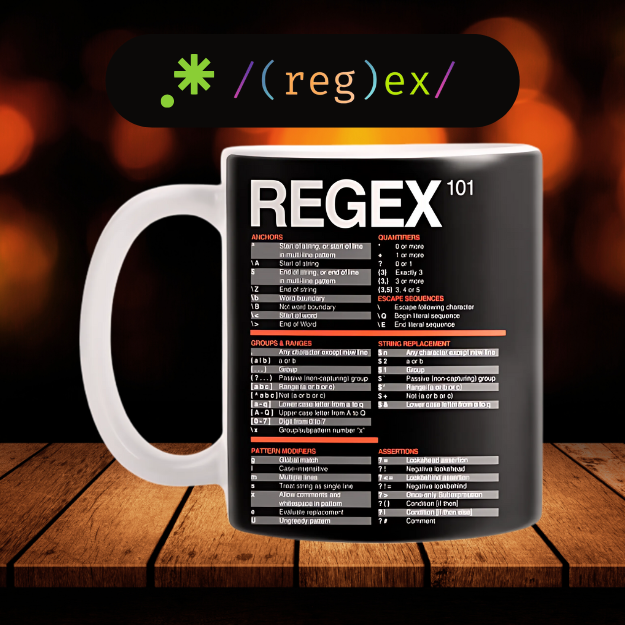

<div align="center">
<br>



</div>


<p align="center">


</p>


<h1 align="center"> RegEx </h1>


<h3 align="center">
<a href="https://github.com/RazikaBengana/holbertonschool-interview/tree/main/regex#eye-about">About</a> •
<a href="https://github.com/RazikaBengana/holbertonschool-interview/tree/main/regex#computer-requirements">Requirements</a> •
<a href="https://github.com/RazikaBengana/holbertonschool-interview/tree/main/regex#hammer_and_wrench-task">Task</a>
</h3>

---

<!-- ------------------------------------------------------------------------------------------------- -->

<br>
<br>

## :eye: About

<br>

<div align="center">

**`RegEx`** project focuses on implementing regular expression matching.
<br>
The project covers pattern matching and string manipulation.
<br>
<br>
This project has been created by **[Holberton School](https://www.holbertonschool.com/about-holberton)** to enable every student to understand how regular expressions in `C` work.

</div>

<br>
<br>

<!-- ------------------------------------------------------------------------------------------------- -->

## :computer: Requirements

<br>

```diff

General

+ Allowed editors: vi, vim, emacs

+ All your files will be compiled on Ubuntu 14.04 LTS

+ Your programs and functions will be compiled with gcc 4.8.4 using the flags -Wall -Werror -Wextra and -pedantic

+ All your files should end with a new line

+ Your code should use the Betty style. It will be checked using betty-style.pl and betty-doc.pl

- You are not allowed to use global variables

+ No more than 5 functions per file

+ In the following examples, the main.c files are shown as examples. You can use them to test your functions, but you don’t have to push them to your repo (if you do we won’t take them into account). We will use our own main.c files at compilation. Our main.c files might be different from the one shown in the examples

+ The prototypes of all your functions should be included in your header file called regex.h

+ Don’t forget to push your header file

+ All your header files should be include guarded

```

<br>

**_Why all your files should end with a new line? See [HERE](https://unix.stackexchange.com/questions/18743/whats-the-point-in-adding-a-new-line-to-the-end-of-a-file/18789)_**

<br>
<br>

<!-- ------------------------------------------------------------------------------------------------- -->

## :hammer_and_wrench: Task

<br>

<table align="center">
<tr>
<td>

### **`0. Simple RegEx`**

---

<br>

- Write a function that checks whether a given pattern matches a given string.

    - Prototype: `int regex_match(char const *str, char const *pattern);`, where:

        - `str` is the string to scan

        - `pattern` is the regular expression

    - Your function must return `1` if the pattern matches the string, or `0` if it doesn’t

    - `str` can be empty, and can contain any ASCII character in the exception of `.` and `*`

    - `pattern` can be empty, and can contain any ASCII character, including `.` and `*`

    - The regular expression matching must support the characters `.` and `*`

        - `.` matches any single character

        - `*` matches zero or more of the preceding character

<br>
<br>

```c
alex@~/holbertonschool-interview_prep/regex$ cat main.c
#include <stdlib.h>
#include <stdio.h>

#include "regex.h"

#define TEST_MATCH(s, p)    do {\
    {\
        int res = regex_match(s, p);\
        printf("%s -> %s = %d\n", s, p, res);\
    }\
} while(0)

/**
 * main - Entry point
 *
 * Return: EXIT_SUCCESS or EXIT_FAILURE
 */
int main(void)
{
    TEST_MATCH("H", "H");
    TEST_MATCH("HH", "H");
    TEST_MATCH("HH", "H*");
    TEST_MATCH("HHHHHHHHHHHHHHHHH", "H*");

    TEST_MATCH("Holberton", ".*");
    TEST_MATCH("Alex", ".*");
    TEST_MATCH("Guillaume", ".*");
    TEST_MATCH("Julien", ".*");

    TEST_MATCH("Holberton", "Z*H.*");
    TEST_MATCH("Holberton", "Z*H.*olberton");
    TEST_MATCH("Holberton", "Z*H.*o.");
    TEST_MATCH("Holberton", "Z*H.*o");

    TEST_MATCH("Holberton", "holberton");
    TEST_MATCH("Holberton", ".olberton");

    TEST_MATCH("!H@o#l$b%e^r&t(o)n_", "!.@.#.$.%.^.&.(.)._");

    return (EXIT_SUCCESS);
}
```

<br>

```c
alex@~/holbertonschool-interview_prep/regex$ gcc -Wall -Wextra -Werror -pedantic main.c regex.c
alex@~/holbertonschool-interview_prep/regex$ ./a.out
H -> H = 1
HH -> H = 0
HH -> H* = 1
HHHHHHHHHHHHHHHHH -> H* = 1
Holberton -> .* = 1
Alex -> .* = 1
Guillaume -> .* = 1
Julien -> .* = 1
Holberton -> Z*H.* = 1
Holberton -> Z*H.*olberton = 1
Holberton -> Z*H.*o. = 1
Holberton -> Z*H.*o = 0
Holberton -> holberton = 0
Holberton -> .olberton = 1
!H@o#l$b%e^r&t(o)n_ -> !.@.#.$.%.^.&.(.)._ = 1
alex@~/holbertonschool-interview_prep/regex$
```

<br>

</td>
</tr>
</table>