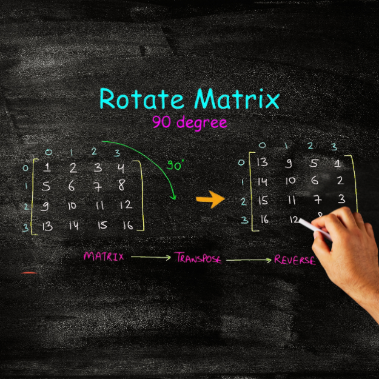

<div align="center">
<br>



</div>


<p align="center">


</p>


<h1 align="center"> Rotate 2D Matrix </h1>


<h3 align="center">
<a href="https://github.com/RazikaBengana/holbertonschool-interview/tree/main/rotate_2d_matrix#eye-about">About</a> •
<a href="https://github.com/RazikaBengana/holbertonschool-interview/tree/main/rotate_2d_matrix#computer-requirements">Requirements</a> •
<a href="https://github.com/RazikaBengana/holbertonschool-interview/tree/main/rotate_2d_matrix#hammer_and_wrench-task">Task</a>
</h3>

---

<!-- ------------------------------------------------------------------------------------------------- -->

<br>
<br>

## :eye: About

<br>

<div align="center">

**`Rotate 2D Matrix`** project involves rotating a 2D matrix.
<br>
The project explores matrix manipulation and transformations.
<br>
<br>
This project has been created by **[Holberton School](https://www.holbertonschool.com/about-holberton)** to enable every student to understand how matrix operations in `Python` work.

</div>

<br>
<br>

<!-- ------------------------------------------------------------------------------------------------- -->

## :computer: Requirements

<br>

```diff

General

+ Allowed editors: vi, vim, emacs

+ All your files will be interpreted/compiled on Ubuntu 14.04 LTS using python3 (version 3.4.3)

+ All your files should end with a new line

+ The first line of all your files should be exactly #!/usr/bin/python3

+ A README.md file, at the root of the folder of the project, is mandatory

+ Your code should use the PEP 8 style (version 1.7.x)

- You are not allowed to import any module

+ All modules and functions must be documented

+ All your files must be executable

```

<br>

**_Why all your files should end with a new line? See [HERE](https://unix.stackexchange.com/questions/18743/whats-the-point-in-adding-a-new-line-to-the-end-of-a-file/18789)_**

<br>
<br>

<!-- ------------------------------------------------------------------------------------------------- -->

## :hammer_and_wrench: Task

<br>

<table align="center">
<tr>
<td>

### **`0. Rotate 2D Matrix`**

---

<br>

- Given an `n` x `n` 2D matrix, rotate it 90 degrees clockwise.

    - Prototype: `def rotate_2d_matrix(matrix):`

    - Do not return anything. The matrix must be edited **in-place**.

    - You can assume the matrix will have 2 dimensions and will not be empty.

<br>
<br>

```python
jessevhedden$ cat main_0.py
#!/usr/bin/python3
"""
Test  - Rotate 2D Matrix
"""
rotate_2d_matrix = __import__('0-rotate_2d_matrix').rotate_2d_matrix

if __name__ == "__main__":
    matrix = [[1, 2, 3],
              [4, 5, 6],
              [7, 8, 9]]

    rotate_2d_matrix(matrix)
    print(matrix)

jessevhedden$
```

<br>

```python
jessevhedden$ ./main_0.py
[[7, 4, 1],
[8, 5, 2],
[9, 6, 3]]
jessevhedden$
```

<br>

</td>
</tr>
</table>