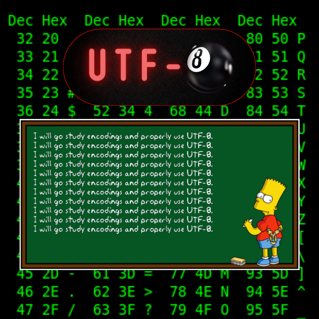

<div align="center">
<br>



</div>


<p align="center">


</p>


<h1 align="center"> UTF-8 Validation </h1>


<h3 align="center">
<a href="https://github.com/RazikaBengana/holbertonschool-interview/tree/main/utf8_validation#eye-about">About</a> •
<a href="https://github.com/RazikaBengana/holbertonschool-interview/tree/main/utf8_validation#mag_right-resources">Resources</a> •
<a href="https://github.com/RazikaBengana/holbertonschool-interview/tree/main/utf8_validation#computer-requirements">Requirements</a> •
<a href="https://github.com/RazikaBengana/holbertonschool-interview/tree/main/utf8_validation#hammer_and_wrench-task">Task</a>
</h3>

---

<!-- ------------------------------------------------------------------------------------------------- -->

<br>
<br>

## :eye: About

<br>

<div align="center">

**`UTF-8 Validation`** project involves validating UTF-8 encoded data.
<br>
The project demonstrates encoding standards and validation techniques.
<br>
<br>
This project has been created by **[Holberton School](https://www.holbertonschool.com/about-holberton)** to enable every student to understand how encoding validation in `Python` works.

</div>

<br>
<br>

<!-- ------------------------------------------------------------------------------------------------- -->

## :mag_right: Resources

<br>

**_Do you need some help?_**

<br>

**Read or watch:**

* [UTF-8](https://en.wikipedia.org/wiki/UTF-8)

* [Characters, Symbols, and the Unicode Miracle](https://www.youtube.com/watch?v=MijmeoH9LT4)

<br>
<br>

<!-- ------------------------------------------------------------------------------------------------- -->

## :computer: Requirements

<br>

```diff

General

+ Allowed editors: vi, vim, emacs

+ All your files will be interpreted/compiled on Ubuntu 14.04 LTS using python3 (version 3.4.3)

+ All your files should end with a new line

+ The first line of all your files should be exactly #!/usr/bin/python3

+ A README.md file, at the root of the folder of the project, is mandatory

+ Your code should use the PEP 8 style (version 1.7.x)

+ All your files must be executable

```

<br>

**_Why all your files should end with a new line? See [HERE](https://unix.stackexchange.com/questions/18743/whats-the-point-in-adding-a-new-line-to-the-end-of-a-file/18789)_**

<br>
<br>

<!-- ------------------------------------------------------------------------------------------------- -->

## :hammer_and_wrench: Task

<br>

<table align="center">
<tr>
<td>

### **`0. UTF-8 Validation`**

---

<br>

- Write a method that determines if a given data set represents a valid `UTF-8` encoding.

    - Prototype: `def validUTF8(data)`

    - Return: `True` if data is a valid `UTF-8` encoding, else return `False`

    - A character in `UTF-8` can be **1 to 4 bytes long**

    - The data set can contain multiple characters

    - The data will be represented by a list of integers

    - Each integer represents **1 byte** of data, therefore you only need to handle the **8 least significant bits** of each integer

<br>
<br>

```python
carrie@ubuntu:~/utf8_validation$ cat 0-main.py
#!/usr/bin/python3
"""
Main file for testing
"""

validUTF8 = __import__('0-validate_utf8').validUTF8

data = [65]
print(validUTF8(data))

data = [80, 121, 116, 104, 111, 110, 32, 105, 115, 32, 99, 111, 111, 108, 33]
print(validUTF8(data))

data = [229, 65, 127, 256]
print(validUTF8(data))

carrie@ubuntu:~/utf8_validation$
```

<br>

```python
carrie@ubuntu:~/utf8_validation$ ./0-main.py
True
True
False
carrie@ubuntu:~/utf8_validation$
```

<br>

</td>
</tr>
</table>